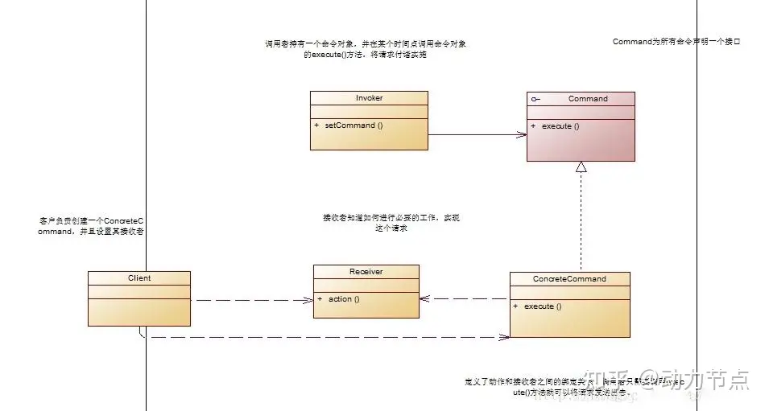

命令模式的本质是将请求封装成对象，将发出命令与执行命令的责任分开，命令的发送者和接收者完全解耦，
发送者只需知道如何发送命令，不需要关心命令是如何实现的，甚至是否执行成功都不需要理会。
命令模式的关键在于引入了抽象命令接口，发送者针对抽象命令接口编程，只有实现了抽象命令接口的具体命令才能与接收者相关联。

使用命令模式的优势在于降低了系统的耦合度，而且新命令可以很方便添加到系统中，也容易设计一个组合命令。
但缺点在于会导致某些系统有过多的具体命令类，因为针对每一个命令都需要设计一个具体命令类。
