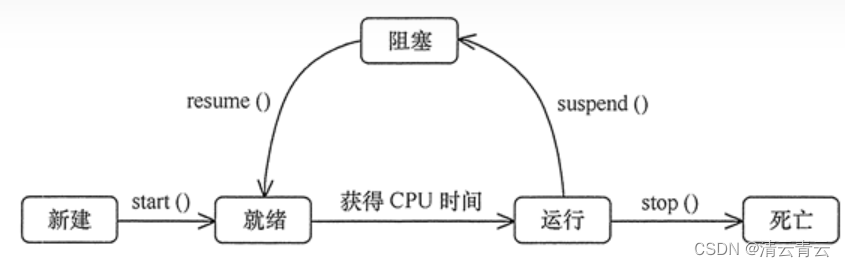

状态模式State对有状态的对象，把复杂的判断逻辑提取到不同的状态对象中，允许状态对象在其内部状态发生改变时改变其行为。

应用场景：
1.当一个对象的行为取决于它的状态，并且它必须在运行时根据状态改变它的行为时，就可以考虑使用状态模式；

2.一个操作中含有庞大的分支结构，并且这些分支决定于对象的状态时。

优点：

1.结构清晰，状态模式将与特定状态相关的行为局部化到一个状态中，并且将不同状态的行为分隔开来，满足单一职责原则；

2.将状态转换化，减少对象间的相互依赖，将不同的状态引入独立的对象中会使得状态转换变得更加明确，且减少对象间的相互依赖；

3.状态类职责明确，有利于程序的扩展，通过定义新的子类很容易的增加新的状态和转换。
状态模式的优点在于：

（1）封装了转换规则，允许状态转换逻辑与状态对象合成一体，而不是某一个巨大的条件语句块

（2）将所有与状态有关的行为放到一个类中，可以方便地增加新的状态，只需要改变对象状态即可改变对象的行为。

但是状态模式的缺点在于：

（1）需要在枚举状态之前需要确定状态种类

（2）会导致增加系统类和对象的个数。

（3）对 “开闭原则” 的支持并不友好，新增状态类需要修改那些负责状态转换的源代码，否则无法切换到新增状态；
而且修改某个状态类的行为也需修改对应类的源代码。

所以状态模式适用于：代码中包含大量与对象状态有关的条件语句，以及对象的行为依赖于它的状态，并且可以根据它的状态改变而改变它的相关行为。
例如：线程的状态转换
