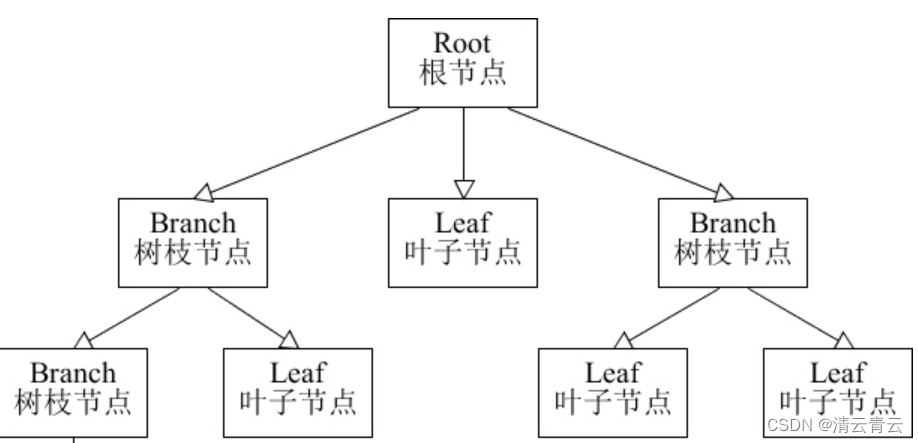

组合模式Composite有时候又叫做整体-部分模式，它是一种将对象组合成树状的层次结构模式，用来表示整体-部分的关系，
是用户对单个对象和组合对象有一致的访问性，属于结构形设计模式。它将对象组织到树形结构中，顶层的节点被称为根节点，
根节点下面可以包含树枝节点和叶子节点，树枝节点下面又可以包含树枝节点和叶子节点，树形结构图如下：

应用场景：

1.在需要表示一个对象整体与部分的层次结构的场合；

2.要求对用户隐藏组合对象与单个对象的不同，用户可以用统一的接口使用组合结构中的所有对象的场合。

优点：

1.组合模式使得客户端代码可以一致的处理当个对象和组合对象，无须关心自己处理的是单个对象还是组合对象，简化了客户端代码；

2.更容易在组合体内加入新的对象，客户端不会因为加入了新的对象而改变源代码，满足开闭原则。
————————————————
版权声明：本文为CSDN博主「清云青云」的原创文章，遵循CC 4.0 BY-SA版权协议，转载请附上原文出处链接及本声明。
原文链接：https://blog.csdn.net/ZHANGLIZENG/article/details/127511376